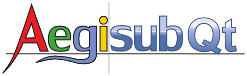

<div align="center">



# AegisubQT

**基于 Qt 6 Quick 与现代 C++20 构建的新一代高级 ASS/SSA 动画字幕制作与特效排版引擎**

[](https://github.com/Cuptu/AegisubQT/releases)
[](https://github.com/Cuptu/AegisubQT)
[](https://github.com/Cuptu/AegisubQT)
[](https://en.cppreference.com/w/cpp/20)
[](https://www.qt.io/)
[](https://luajit.org/)
[](./LICENSE)

[English](README.md) · [简体中文](README_zh.md) · [架构特性](#1-核心特性与架构亮点) · [原版代码映射](#2-原版代码架构全景对照表) · [构建指南](#4-构建与编译指南)

</div>

> [!NOTE]
> **现代化重构版声明 (v4.0.0+)**：AegisubQT 是业界标准字幕制作软件 **Aegisub** 的独立开源现代化重构项目，基于 **Qt 6 Quick (QML)** 与 **C++20** 构建。版本号从 **4.0.0** 开始起步，承接原版 Aegisub 3.2.x / 3.4.x 的历史沉淀，跨入新一代高性能跨平台桌面图形技术栈。

**AegisubQT** 是一款免费、跨平台、开源的字幕创建与编辑工具。Aegisub 让根据音频对齐字幕时间轴变得轻松高效，并提供了丰富的样式与排版工具，包含内置实时视频预览视口与 GPU 硬件加速音频频谱。

---

## 1. 核心特性与架构亮点

- **硬件加速音频频谱图**：自定义 QQuickItem (`SpectrogramItem`)，通过 Qt 渲染硬件接口 (QRHI) 调用硬件 GPU 着色器 (`spectrogram.vert.qsb`, `spectrogram.frag.qsb`)，替代旧版 CPU 内存拷贝绘图（`audio_display.cpp`），实现异步零拷贝 FFT 缓存与平滑渲染。
- **硬件加速视频视口与播放流水线**：深度集成 QtMultimedia FFmpeg 7.1 硬件解码引擎，内嵌于 `VideoBox.qml`，与亚毫秒级音频控制器深度同步联动，实时驱动时间轴游标与矢量排版画布。
- **AstraCore 高性能媒体桥接**：通过 C 原生 ABI 桥接层 (`AstraCoreBridge`) 挂载 `AstraCore.Native.dll`，实现极速视频解复用、元数据提取与免重新编码 PCM 音频无缝抽取（"从视频中打开音频"）。
- **关键帧与时间码子系统**：完整实现 Keyframe Format v1 关键帧文件导入导出 (`.txt`) 与变帧率 (VFR) 时间码表解析 (`.tc`)，音频波形图与频谱图支持关键帧红线标记实时绘制与鼠标磁吸对齐。
- **现代化视频视口与视觉排版**：精确实现 ASS 脚本分辨率空间（`PlayResX`, `PlayResY`）与视口渲染显示坐标之间的双向几何变换。提供与 ASS 规范对齐的矢量视觉排版工具（十字光标、坐标拖拽、Z 轴旋转、比例缩放、矩形裁剪）。
- **高性能字幕与全局样式库模型**：响应式 C++ 字幕模型 (`SubtitleModel`) 与样式仓储管理器 (`StyleStorageManager`)，支持脚本样式与全局样式库实时双向同步、非线性历史撤销追踪、亚毫秒级时间平移、正则查找替换与时间轴后处理。
- **内嵌 libaegisub C++20 核心**：完整解耦 Boost 与 ICU 外部重型依赖的纯标准 C++20 `libaegisub` 静态库，提供 DFA 词法解析器、卡拉OK音节切分、ASS 时间戳运算、行内特殊字符编解码与颜色转换。
- **Automation 4 Lua 自动化子系统**：集成原生 LuaJIT + LPeg + Win32 GDI / DirectWrite 字体度量（`calculate_text_extents`），兼容 Aegisub 标准自动化宏脚本（如 `kara-templater.lua`、`clean-info.lua`）。
- **免重启多语言国际化无缝切换**：内建 `LanguageManager`，支持 9 种语言（简体中文、繁体中文、英语、日语、韩语、德语、法语、西班牙语、俄语）实时热切换。
- **全格式文件拖拽直达管线**：原生支持外部直接拖放加载视频文件 (`.mp4`, `.mkv` 等)、音频文件 (`.wav` 等)、字幕工程 (`.ass`, `.srt`)、关键帧表 (`.txt`) 与时间码表 (`.tc`)。
- **原生桌面人机交互规范**：采用高性能 QML 原生图元（`NativeDialogFrame`, `NativeTreeBook`, `NativeGroupBox`, `NativeSpinBox` 等），还原 Win32 原生桌面对话框人机交互（`wxTreeCtrl`, `wxStaticBox`, `wxRadioBox`, `wxListView`）。

---

## 2. 上游源码映射表

便于熟悉原版 Aegisub（`Aegisub-master`）的开发者直观对照，下表列出了旧版 wxWidgets C++ 源码文件与当前 Qt 6 Quick / C++20 实现的对应关系。

### 2.1 核心程序、桥接层与生命周期

| 上游 wxWidgets 源码 (`src/`) | Qt Quick 对应文件 (`aegisub_qt_quick/`) | 职责与子系统 |
| :--- | :--- | :--- |
| `main.cpp` | `src/main.cpp` | 应用程序入口点、命令行参数解析 (`--audio`, `--video`, `--ass`, `--lang`)、引擎初始化与字体配置。 |
| `frame_main.cpp`, `frame_main.h` | `qml/Main.qml`, `qml/views/TopMenuBar.qml`, `qml/views/TopToolBar.qml` | 顶层主窗口布局、菜单栏派发、全局快捷键映射、工具栏命令路由。 |
| `project.cpp`, `project.h` | `qml/project/SubtitleProject.qml`, `qml/project/AssUtils.js` | 工程生命周期管理、文档脏状态追踪、Undo/Redo 历史栈、ASS 文本解析与序列化。 |
| *(全新 AstraCore 桥接层)* | `src/bridge/AstraCoreBridge.h`, `src/bridge/AstraCoreBridge.cpp` | AstraCore 原生 C ABI 动态链接与无损音频解复用抽取。 |
| *(全新语言国际化管理器)* | `src/bridge/LanguageManager.h`, `src/bridge/LanguageManager.cpp` | 多语言翻译字典加载与全局 UI 动态实时热重载。 |

### 2.2 视频视口与视觉排版工具

| 上游 wxWidgets 源码 (`src/`) | Qt Quick 对应文件 (`aegisub_qt_quick/`) | 职责与子系统 |
| :--- | :--- | :--- |
| `video_controller.cpp`, `video_controller.h` | `src/video/VideoController.cpp`, `src/video/VideoController.h` | 视频播放状态机、帧精确定位、空白视频生成、关键帧/时间码文件导入导出与同步。 |
| `video_display.cpp`, `video_display.h` | `src/video/VideoDisplayController.cpp`, `src/video/VideoDisplayController.h` | 视口缩放、画布平移、鼠标中键拖拽导航、脚本与显示坐标系双向转换。 |
| `video_box.cpp`, `video_box.h` | `qml/views/VideoBox.qml` | 视频视口 QML 容器（集成 QtMultimedia FFmpeg 硬解）、时间线进度条、播放控制条、视觉排版图层覆盖。 |
| `visual_tool.cpp`, `visual_tool.h` | `src/video/VisualToolBase.cpp`, `src/video/VisualToolBase.h` | 屏幕排版工具基类、覆盖标签提取与序列化 (`\pos`, `\move`, `\clip`)。 |
| `visual_tool_cross.cpp`, `visual_tool_cross.h` | `src/video/VisualTools.cpp` (`VisualToolCross`) | 坐标十字定位与设置工具 (`\pos`)。 |
| `visual_tool_drag.cpp`, `visual_tool_drag.h` | `src/video/VisualTools.cpp` (`VisualToolDrag`) | 字幕定位锚点、位移起点终点与旋转原点拖拽工具 (`\pos`, `\move`, `\org`)。 |
| `visual_tool_rotatez.cpp`, `visual_tool_rotatez.h` | `src/video/VisualTools.cpp` (`VisualToolRotateZ`) | Z 轴平面旋转罗盘量角器 (`\frz`)。 |
| `visual_tool_scale.cpp`, `visual_tool_scale.h` | `src/video/VisualTools.cpp` (`VisualToolScale`) | 字幕水平与垂直比例缩放手柄 (`\fscx`, `\fscy`)。 |
| `visual_tool_clip.cpp`, `visual_tool_clip.h` | `src/video/VisualTools.cpp` (`VisualToolClip`) | 矩形裁剪区域编辑工具，支持四角与边缘拖拽手柄 (`\clip`)。 |

### 2.3 音频子系统与频谱图

| 上游 wxWidgets 源码 (`src/`) | Qt Quick 对应文件 (`aegisub_qt_quick/`) | 职责与子系统 |
| :--- | :--- | :--- |
| `audio_controller.cpp`, `audio_controller.h` | `src/audio/AudioController.cpp`, `src/audio/AudioController.h` | 音轨异步线程加载、选区边界管理、播放游标调度、关键帧红线吸附同步。 |
| `audio_display.cpp`, `audio_display.h` | `src/audio/AudioDisplayController.cpp`, `src/audio/AudioDisplayController.h` | 音频时间线交互、鼠标拖拽选区吸附、关键帧吸附逻辑。 |
| `audio_renderer_spectrum.cpp` | `src/audio/AegisubStftCore.cpp`, `src/audio/AegisubStftCore.h` | 短时傅里叶变换 (STFT)、滑窗 FFT 计算、频率响应曲线变换。 |
| `audio_display.cpp` (渲染分支) | `src/audio/SpectrogramItem.cpp`, `src/audio/SpectrogramShaderMaterial.cpp` | QRHI / OpenGL / Direct3D 硬件加速频谱图顶点与片元着色器渲染。 |
| `audio_colorscheme.cpp`, `audio_colorscheme.h` | `src/audio/AudioColorScheme.cpp`, `src/audio/AudioColorScheme.h` | 波形与频谱图颜色调色板生成 (12-bit LUT 映射)。 |
| `audio_provider_*.cpp` | `src/audio/AudioPcmProvider.cpp`, `src/audio/AudioPcmProvider.h` | 多格式音频 PCM 流解码与重采样。 |
| `audio_box.cpp`, `audio_box.h` | `qml/views/AudioBox.qml` | 音频波形/频谱图视图布局、播放控制按钮组、缩放与音量滑块、关键帧红线绘制。 |

### 2.4 字幕网格与编辑框

| 上游 wxWidgets 源码 (`src/`) | Qt Quick 对应文件 (`aegisub_qt_quick/`) | 职责与子系统 |
| :--- | :--- | :--- |
| `subs_grid.cpp`, `subs_grid.h` | `qml/views/SubtitleGridArea.qml`, `src/model/SubtitleModel.cpp` | 高性能虚拟化字幕表格、C++ 核心数据模型、多行选择操作、右键快捷上下文菜单。 |
| `subs_edit_box.cpp`, `subs_edit_box.h` | `qml/views/SubtitleEditBox.qml` | 字幕文本编辑器、样式标签快捷按钮组、持续时间计算、说话人/特效下拉框。 |
| `subs_edit_ctrl.cpp`, `subs_edit_ctrl.h` | `qml/views/SubtitleEditBox.qml` | 实时标签语法验证与文本提交派发。 |
| *(全新全局样式仓储管理器)* | `src/model/StyleStorageManager.h`, `src/model/StyleStorageManager.cpp` | 双栏样式持久化管理（全局存储库 vs 当前脚本库）。 |

### 2.5 对话框与辅助窗口

| 上游 wxWidgets 源码 (`src/`) | Qt Quick 对应文件 (`aegisub_qt_quick/`) | 职责与子系统 |
| :--- | :--- | :--- |
| `dialog_manager.cpp` | `qml/dialogs/DialogManager.qml` | 全局对话框中枢调度器、事件聚合与视图派发。 |
| `dialog_preferences.cpp`, `preferences.cpp` | `qml/dialogs/DialogPreferences.qml` | 12 分页层级式设置面板（基于 `wxTreebook` 交互风格）。 |
| `dialog_shift_times.cpp` | `qml/dialogs/DialogShiftTimes.qml` | 时间轴平移对话框（时间/帧数双模、历史记录、生效范围选择）。 |
| `dialog_selection.cpp` | `qml/dialogs/DialogSelectLines.qml` | 高级字幕多重条件筛选与选择器（字段、正则、大小写、注释筛选）。 |
| `dialog_timing_processor.cpp` | `qml/dialogs/DialogTimingProcessor.qml` | 时间轴后处理器（提前量/延后量批量扩展、相邻行间隙吸附、关键帧对齐）。 |
| `dialog_style_manager.cpp` | `qml/dialogs/DialogStyleManager.qml` | 样式管理器（全局存储库与当前工程库双向复制、样式新建与维护）。 |
| `dialog_style_editor.cpp` | `qml/dialogs/DialogStyleEditor.qml` | ASS 样式编辑器（字体、4 通道颜色、边距、小键盘九宫格对齐、实时预览）。 |
| `dialog_colorpicker.cpp` | `qml/dialogs/DialogColorPicker.qml` | 2D 颜色选取盘、原色/现色对比、屏幕吸管取色、ASS 16 进制颜色编码。 |
| `dialog_search_replace.cpp` | `qml/dialogs/DialogSearchReplace.qml` | 查找与替换对话框（正则表达式支持、限定字段、跳过特效标签）。 |
| `dialog_spellchecker.cpp` | `qml/dialogs/DialogSpellChecker.qml` | 拼写检查助手、词典匹配与单词替换建议。 |
| `dialog_styling_assistant.cpp` | `qml/dialogs/DialogStylingAssistant.qml` | 极速键盘流样式分配助手（`Enter`、`Page Up`、`Page Down` 快捷键盲打）。 |
| `dialog_translation.cpp` | `qml/dialogs/DialogTranslation.qml` | 双语对照字幕翻译助手（支持音频/视频段落快捷复听与对照提交）。 |
| `dialog_video_details.cpp` | `qml/dialogs/DialogVideoDetails.qml` | 视频流元数据检视器（分辨率、帧率、总帧数、色彩矩阵、解码器）。 |
| `dialog_dummy_video.cpp` | `qml/dialogs/DialogDummyVideo.qml` | 空白视频生成器（FPS、分辨率、时长、测试色块定制）。 |
| `dialog_attachments.cpp` | `qml/dialogs/DialogAttachments.qml` | 内嵌字体与图片附件管理器（列表模式、提取与附加）。 |
| `dialog_properties.cpp` | `qml/dialogs/DialogProperties.qml` | 脚本工程属性（PlayResX/Y、标题、换行模式、边框阴影缩放、YCbCr 矩阵）。 |
| `dialog_resample.cpp` | `qml/dialogs/DialogResample.qml` | 脚本分辨率重采样（等比缩放字体大小与四向边距）。 |
| `dialog_jumpto.cpp` | `qml/dialogs/DialogJumpTo.qml` | 帧号 / 时间戳双模精确跳转对话框。 |
| `dialog_fonts_collector.cpp` | `qml/dialogs/DialogFontsCollector.qml` | 字体收集器（遍历工程使用字体并打包提取到目标目录）。 |
| `dialog_kanji_timer.cpp` | `qml/dialogs/DialogKanjiTimer.qml` | 日语汉字卡拉OK时间轴复制器。 |
| `dialog_paste_over.cpp` | `qml/dialogs/DialogPasteOver.qml` | 选择性属性覆盖粘贴（时间、文本、样式、说话人、特效、边距）。 |
| `dialog_autosave.cpp` | `qml/dialogs/DialogAutosave.qml` | 崩溃自动备份与历史自动保存恢复器。 |
| `dialog_automation.cpp` | `qml/dialogs/DialogAutomation.qml` | Automation 4 Lua 自动化脚本管理器（自动加载、重载、脚本信息）。 |
| `dialog_export.cpp` | `qml/dialogs/DialogExport.qml` | 字幕导出转换流水线与字符集编码导出。 |
| `dialog_about.cpp` | `qml/dialogs/DialogAbout.qml` | 关于对话框（版本信息、开源许可证、核心贡献者致谢）。 |

### 2.6 Automation 与核心库

| 上游源码 (`src/` / `libaegisub/`) | Qt Quick 对应文件 (`aegisub_qt_quick/`) | 职责与子系统 |
| :--- | :--- | :--- |
| `auto4_base.cpp`, `auto4_lua.cpp` | `src/automation/AutomationManager.cpp`, `src/automation/LuaScript.cpp` | Lua 虚拟机宿主、宏命令注册、导出滤镜注册、自动加载目录扫描。 |
| `auto4_lua_assfile.cpp` | `src/automation/LuaAssFileBridge.cpp` | Lua 表与 SubtitleProject 之间的双向字幕数据映射桥梁。 |
| GDI/FreeType text extents | `src/automation/LuaTextExtents.cpp` | 原生平台字体度量计算，支撑 `aegisub.text_extents` 布局排版计算。 |
| `libaegisub/ass/dialogue_parser.cpp` | `libaegisub/src/dialogue_parser.cpp` | ASS 特效标签与正文词法分词器。 |
| `libaegisub/ass/karaoke.cpp` | `libaegisub/src/karaoke.cpp` | 卡拉OK音节切分与音节持续时间解析器 (`\k`, `\K`, `\kf`, `\ko`)。 |
| `libaegisub/ass/time.cpp` | `libaegisub/src/time.cpp` | ASS 时间戳格式解析 (`h:mm:ss.cs`) 与时间运算。 |
| `libaegisub/common/color.cpp` | `libaegisub/src/color.cpp` | 颜色解析器与 ASS 格式颜色代码生成 (`&HBBGGRR&`)。 |
| `libaegisub/ass/string_codec.cpp` | `libaegisub/src/string_codec.cpp` | 行内特殊字符转义与工程文件数据编解码器。 |

---

## 3. 目录结构

```text
AegisubQT/
├── assets/
│   ├── bin/                  # 原生运行时依赖 (AstraCore.Native.dll)
│   ├── branding/             # 项目横幅与品牌素材
│   └── icons_native/         # 高清原生 PNG 图标
├── libaegisub/               # 现代化 C++20 嵌入式 libaegisub 核心算法库
├── locale/                   # Qt 编译二进制 .qm 与源 .ts 语言包 (8 种翻译 + 英语源语言)
├── luajit/                   # LuaJIT 2.1 运行时头文件与静态库
├── qml/
│   ├── Main.qml              # 应用程序主窗口根组件与全局菜单路由
│   ├── controls/             # 桌面原生外观控件库 (Win32 原生交互规范)
│   ├── dialogs/              # 25 个独立功能对话框组件
│   ├── project/              # SubtitleProject 工程数据状态机与 ASS 工具集
│   └── views/                # 核心交互视口 (VideoBox, AudioBox, Grid, Edit)
├── shaders/                  # GLSL / QRHI 硬件加速频谱图着色器 (.vert, .frag)
├── src/
│   ├── audio/                # 音频播放流水线、STFT 计算核心与频谱图渲染节点
│   ├── automation/           # Lua 自动化引擎、C++ 桥接与文本度量测算
│   ├── bridge/               # AstraCore、语言国际化管理器与核心桥接层
│   ├── model/                # SubtitleModel 字幕模型与 StyleStorageManager 样式仓储
│   ├── video/                # 视频控制器、视口显示与视觉排版矢量工具集
│   └── main.cpp              # 应用程序入口点与引擎引导
├── CMakeLists.txt            # CMake 工程构建脚本
├── README.md                 # 架构技术指南与上游映射表 (英文)
└── README_zh.md              # 架构技术指南与上游映射表 (简体中文)
```

---

## 4. 构建与编译指南

### 环境依赖
- **编译器**：Visual Studio 2022 (MSVC v143 x64) 或支持 C++20 的现代 Clang / GCC。
- **图形库**：Qt 6.8+（包含 `Qt6::Core`, `Qt6::Gui`, `Qt6::Quick`, `Qt6::Qml`, `Qt6::QuickControls2`, `Qt6::ShaderTools`, `Qt6::Multimedia` 模块）。
- **构建系统**：CMake 3.20+ 与 Ninja。

### 构建命令
```cmd
:: 载入 MSVC 64位命令行工具链
call "C:\Program Files (x86)\Microsoft Visual Studio\2022\BuildTools\VC\Auxiliary\Build\vcvars64.bat"

:: 生成工程配置
cmake -B build -G Ninja -DCMAKE_BUILD_TYPE=Release

:: 编译并部署二进制产物 (生成 build/AegisubQT.exe 及所需 DLL 与资产)
ninja -C build
```

---

## 5. 开源许可证

本项目采用尊重上游著作权且对新增模块保持开放的组合开源授权结构：

- **MIT License** (Copyright (c) 2026, Cuptu)：涵盖全新设计编写的 Qt Quick 前端组件 (`qml/`)、桌面原生控件库 (`qml/controls/`)、QRHI 频谱图 GPU 着色器 (`shaders/`, `src/audio/SpectrogramItem.*`, `src/audio/SpectrogramShaderMaterial.*`) 以及现代化运行时桥接层 (`src/bridge/`)。
- **BSD 3-Clause License** (Copyright (c) 2005 - 2026, Rodrigo Braz Monteiro, Niels Martin Hansen, arch1t3cht, and Aegisub Contributors)：涵盖 `src/` 中源自上游 Aegisub 的核心生命周期、视口交互、音频子系统与自动化管线。
- **ISC License** (Copyright (c) 2010 - 2014, Thomas Goyne)：涵盖现代化嵌入式 `libaegisub/` C++20 核心算法库。

完整授权条款详见各源码文件头部声明及 [LICENSE](LICENSE) 文件。
